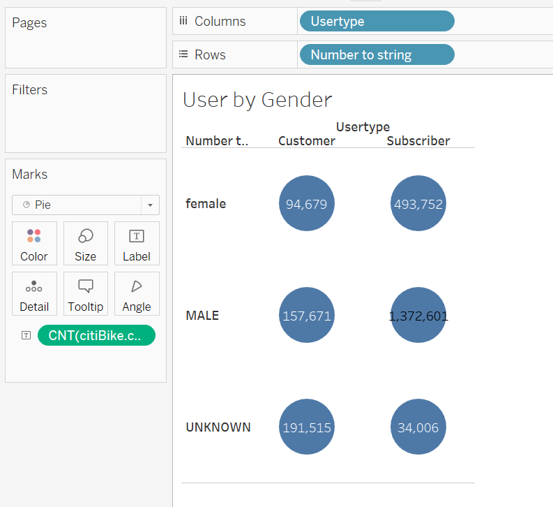
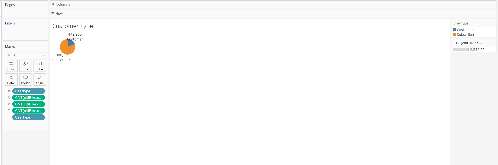
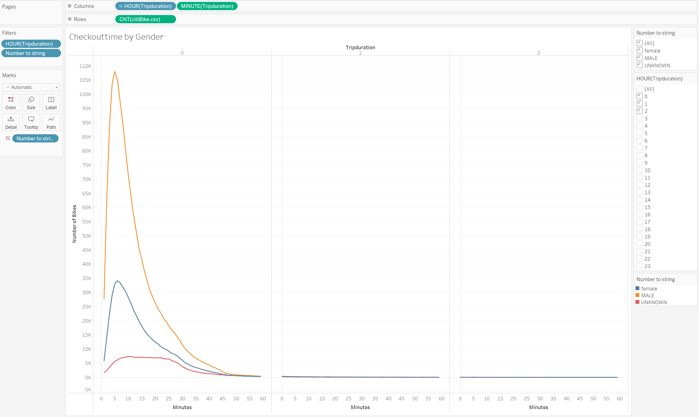
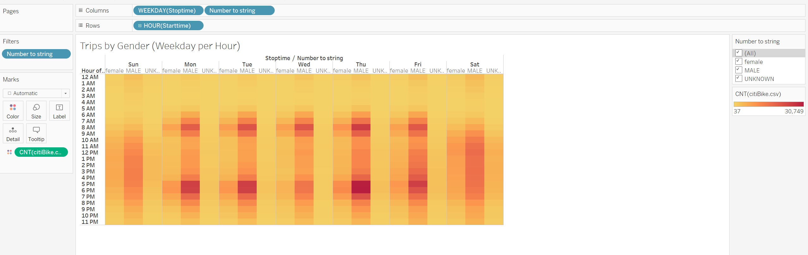
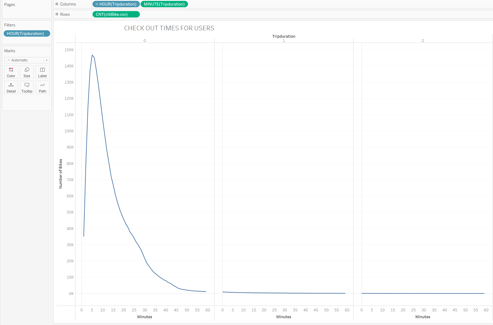
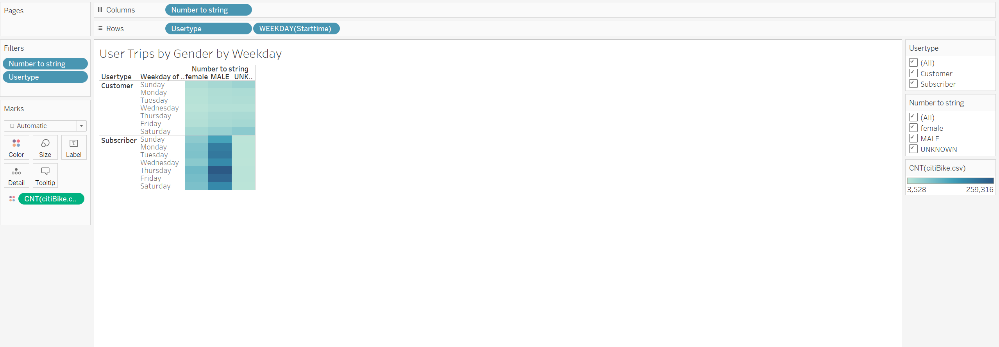
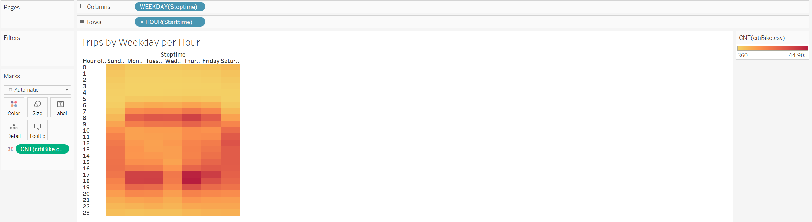

# Bike_Sharing

## Overview

Determine if a bicycle sharing app like Citibike could work great in Des Moines, IA using Tableau

# Website

[Tableau Website](https://public.tableau.com/app/profile/alexei.mendoza7458/viz/NYcitibike_16693399180010/UserbyGender?publish=yes)

# Purpose

Investor is interested in having a bicycle sharing app in Des Moines, IA. The analysis takes citibike data from New York and displays visualizations on Tableau.

# Results

- Subscriber and non-subscribers

- Total in pie chart of subscribers to non

- Male riders are more than female

- 10am- 6pm are top times for weekend rides

- Trip duration spikes around 5-10 min

- Male subscribers do more riding on Thursdays.

- 6am-9am are top times for weekday rides

# Summary

- Having subscriptions makes for better marketing
- Marketing for women could be better
- Tourists areas have more riders
- Early morning weekdays are the most riders
- Males use subscriptions more than women
